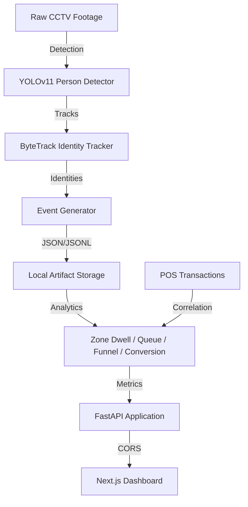

# 03. System Architecture

## Architectural Overview
The system follows a modular, pipeline-based architecture that separates video processing from data serving.

## Core Components

### 1. Ingestion & Processing Pipeline
- **Detection**: Uses YOLOv11n for high-speed inference on CPU/GPU.
- **Tracking**: ByteTrack manages persistent IDs across frames, handling occlusions.
- **Event Engine**: Translates spatial coordinates into business events (`ZONE_ENTER`, `BILLING_QUEUE_JOIN`).

### 2. Analytics Layer
- **Zone Processor**: Calculates time-in-zone for every visitor.
- **Correlation Engine**: Matches visitor billing-zone exit times with POS timestamps.
- **Heuristics**: Group detection based on proximity and co-movement.

### 3. API Layer
- **FastAPI**: Serves store-scoped metrics, anomalies, and health states.
- **Structured Logging**: Every request is tagged with a `trace_id` and `store_id`.
- **Idempotent Ingestion**: Event ingestion protects against duplicate processing using `event_id` tracking.

### 4. Presentation Layer
- **Next.js 15**: A modern, capability-driven dashboard that visualizes heatmaps, funnels, and real-time alerts.
